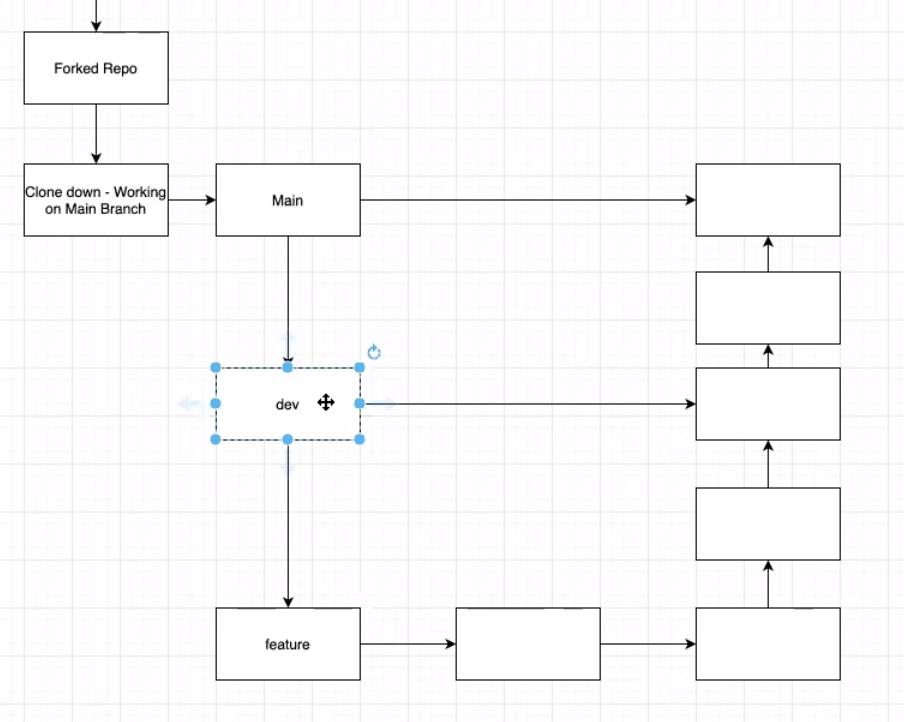

#Commands
##Clone
##

#Best Practices (personal)
##Do
* Commit early and ofted
* Meaningful short messages (not "made some changes")
* WORK ON OWN BRANCH
* Review code pre push
* Maintain proper .gitignore
  * Contains lists of files or directories that git will not manage
  * Passwords etc.
  * IDE keep track files
  * .DS Store type stuff
* Run all tests, makes sure all code runs/compiles before commiting / pushing
## Don't
* Work on the main branch
* delete un-merged
* commit code that doesn't compile or has broken tests

#Work Flow
1. Clone
2. Branch
3. add -> commit -> push

##Pull changes with `Pull`
##Merge
* Add your changes from `main`
##Start working here

#The guts
##Create Branch
`git -a` red means remote
`git diff` on the file shows the diff
`git add` by file (not `.`) to prevent crumbing up the project
`git add -u` only modified files (update in add, different in push)
`git checkout -- filename` undose changes
`git checkout` switches branches
`git checkout -b` creates a branch then switches

##Squash and Merge
* makes one message
## Switch Branch after updating main
Go to your target
git merge `branch to merge (eg main)`

                       