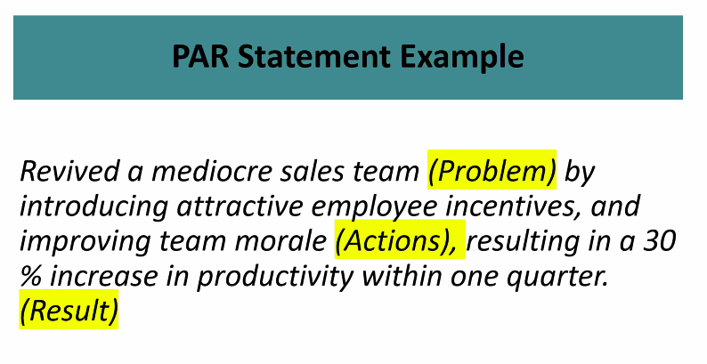

#Resume Workshop
##Pat Troy: Workwise Group

#What is a Resume
* A First Impression
* Snapshot of Career
* A Sales flyer
##Bad things yours may be
* Over a page
* Overly styled fonts
* Maybe too many acronyms, recruiters may not know them
* Lack of keywords
#Resume Info
Provide details on why the 

#Power Verbs
* Verbs with impact
* Created not Made for example
#Keywords
* Hilite them then go
* Make sure to use the word the company uses and not synonyms (EG sourcing vs procurement)
#PAR Statements
* Problem Action Result
* Problem
  * State the **PROBLEM** you faced
* Actions
  * The **ACTIONS** you took
* Result
  * The **RESULTS** you acheived
* Start with verb
* 
)
#Duties and Responsibilities
* Make yourself special, don't give a basic job description

#Template
* 6 words or phrases from list
* additional adjectives
* Positive Statements About Why Developer
##Technical projects
* Get those terms in
* Describe the team
* describe the why
##Professional Experience
* Give more than less
* but not more than a few bullets
